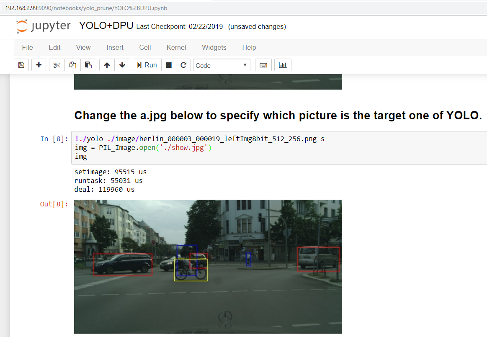

## PYNQ-DPU-Flow

This repository is a guidance to create a PYNQ DPU Overlay and build a PYNQ-Z2 V2.4 image for DPU that compatible with the DPU Overlay, that can be used to accelerate your AI apps based on Xilinx Edge AI solution on PYNQ-Z2.

   

  
To run DPU on PYNQ-Z2, except for instantiating DPU IP to FPGA fabric, the corresponding Linux driver and OpenCV 3.3 library should also be prepared. You can download the pre-built image contains prepared demos from [PYNQ-Z2 V2.4 image for DPU](https://pan.baidu.com/s/1gOJaoJJ8z2jf-BaLklID3Q), or rebuild the PYNQ-Z2 V2.4 image for DPU following the below steps.  

* **Step 1**. Prepare the Vivado project, bootloader, Linux kernel and DPU driver. Please refer to [build-pynqz2-system](https://github.com/xupsh/dnndk3.0-pynqz2/blob/master/build-pynqz2-system.md). The generated BOOT.BIN, image.ub and dpu.ko files will be used by the follow-up step.  

* **Step 2**. Follow the [PYNQ Image Build Flow](https://github.com/Xilinx/PYNQ/tree/master/sdbuild) to build a new image or download the official [PYNQ-Z2 image V2.4](http://www.pynq.io/board.html) (not been verified yet).  

* **Step 3**. Repalce the BOOT.BIN and image.ub of the PYNQ image V2.4 with the files generated in step1.  

* **Step 4**. Copy the dpu.ko and the files in sdcard in step 1 to PYNQ image or download them to the board after booting up.  

* **Step 5**. Boot up the PYNQ-Z2 using the new Image. and follow the following steps to prepare the DPU environments. 

* **Step 6**. Download the source files from https://opencv.org/opencv-3-3.html and then install OpenCV3.3 to board.  

  *sudo apt-get update*  
  *sudo apt-get upgrade*  
  *cd opencv-3.3.0mkdir build*  
  *cd build*  
  *cmake -D CMAKE_BUILD_TYPE=RELEASE -D CMAKE_INSTALL_PREFIX=/usr/local*  
  *make*  
  *make install*  

* **Step 7**. Install dnndk  
  *cd zynq7020_dnndk_v3.0*  
  *./install.sh*  

* **Step 8**. Install DPU module  
  *sudo insmod dpu.ko*  

* **Step 9**. Configure X window client  

  *su*  
  *xauth merge /home/xilinx/.Xauthority*  

* **Step 10**. Install network manager (Optional, if have one wifi dongle)  

  *sudo apt-get install network-manager*  

* **Step 11**. Reboot and then configure wifi connection ( Optionnal)    

  *nmtui*  

## Note

PYNQ is an open-source software framework from Xilinx® that makes it easy to design embedded systems with Xilinx Zynq® Systems on Chips (SoCs).Using the Python language and libraries, designers can exploit the benefits of programmable logic in Zynq to build more capable and exciting embedded systems.

The Xilinx® Deep Learning Processor Unit (DPU) is a programmable engine optimized for convolutional neural networks. The unit includes a high performance scheduler module, a hybrid computing array module, an instruction fetch unit module, and a global memory pool module. The DPU uses a specialized instruction set, which allows for the efficient implementation of many convolutional neural networks. Some examples of convolutional neural networks which have been deployed include VGG, ResNet, GoogLeNet, YOLO, SSD, MobileNet, FPN, and many others. The DPU IP can be implemented in the programmable logic (PL) of the selected Zynq®-7000 SoC or Zynq UltraScale+™ MPSoC devices with direct connections to the processing system (PS). The DPU requires instructions to implement a neural network and accessible memory locations for input images as well as temporary and output data. 